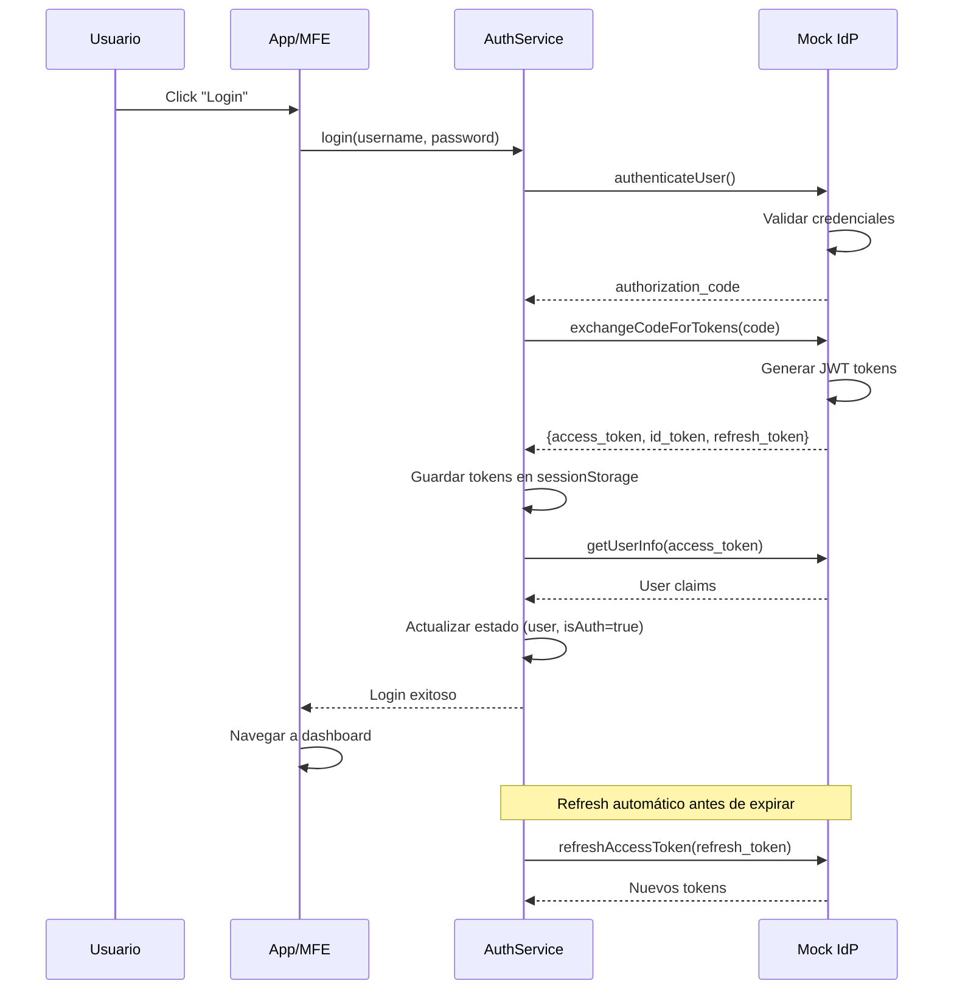

# 🔐 Sistema de Autenticación OIDC - Guía Completa

Sistema de autenticación simulado tipo **OpenID Connect (OIDC)** implementado en el host y compartido con todos los microfrontends via Module Federation.

## 📋 Tabla de Contenidos

- [Descripción General](#descripción-general)
- [Arquitectura](#arquitectura)
- [Usuarios de Demostración](#usuarios-de-demostración)
- [Uso en el Host](#uso-en-el-host)
- [Uso en Microfrontends](#uso-en-microfrontends)
- [Protección de Rutas](#protección-de-rutas)
- [API Reference](#api-reference)

---

## Descripción General

Este sistema simula un Identity Provider (IdP) completo tipo **Auth0**, **Keycloak** o **Azure AD**, implementando el flujo **Authorization Code Flow** de OIDC.

### Características

✅ **Authorization Code Flow** con PKCE
✅ **JWT Tokens** (ID Token y Access Token)
✅ **Refresh Token** automático
✅ **Role-Based Access Control (RBAC)**
✅ **Guards funcionales** de Angular 17
✅ **HTTP Interceptors** para inyección automática de tokens
✅ **Shared via Module Federation** - Un solo punto de autenticación para todos los MFEs

---

## Arquitectura

```
┌─────────────────────────────────────────────────────────────┐
│                         HOST APP                             │
│  ┌───────────────────────────────────────────────────────┐  │
│  │           Mock OIDC Provider (IdP Simulado)           │  │
│  │   - Authorize Endpoint                                │  │
│  │   - Token Endpoint                                    │  │
│  │   - UserInfo Endpoint                                 │  │
│  │   - Logout Endpoint                                   │  │
│  └───────────────────────────────────────────────────────┘  │
│                            ↓                                 │
│  ┌───────────────────────────────────────────────────────┐  │
│  │                   Auth Service                        │  │
│  │   - login()                                           │  │
│  │   - logout()                                          │  │
│  │   - refreshToken()                                    │  │
│  │   - isAuthenticated()                                 │  │
│  │   - hasRole()                                         │  │
│  └───────────────────────────────────────────────────────┘  │
│                            ↓                                 │
│           ┌────────────────┴────────────────┐               │
│           ↓                                 ↓                │
│  ┌──────────────┐                  ┌─────────────────┐      │
│  │    Guards    │                  │  Interceptors   │      │
│  │ - authGuard  │                  │ - authInterceptor│     │
│  │ - roleGuard  │                  │ - errorInterceptor│    │
│  │ - adminGuard │                  └─────────────────┘      │
│  └──────────────┘                                           │
└─────────────────────────────────────────────────────────────┘
                            ↓
        ┌──────────┬────────┴──────┬──────────┬──────────┐
        ↓          ↓                ↓          ↓          ↓
    ┌──────┐  ┌──────┐        ┌──────┐   ┌──────┐   ┌──────┐
    │ MFE1 │  │ MFE2 │        │ MFE3 │   │ MFE4 │   │ MFE5 │
    └──────┘  └──────┘        └──────┘   └──────┘   └──────┘
       ↓          ↓                ↓          ↓          ↓
   Importan AuthService desde host-app via Federation
```

---

## Usuarios de Demostración

El sistema incluye 3 usuarios precargados:

| Email | Password | Roles | Descripción |
|-------|----------|-------|-------------|
| `admin@example.com` | `admin123` | `admin`, `user` | Administrador con acceso completo |
| `manager@example.com` | `manager123` | `manager`, `user` | Manager con permisos intermedios |
| `user@example.com` | `user123` | `user` | Usuario regular |

---

## Uso en el Host

### 1. Servicios Disponibles

```typescript
import { AuthService } from './core/auth';

// Inyectar el servicio
private authService = inject(AuthService);

// Login
this.authService.login('admin@example.com', 'admin123').subscribe({
  next: () => console.log('Login exitoso'),
  error: (err) => console.error('Error:', err)
});

// Logout
this.authService.logout();

// Verificar autenticación
const isAuth = this.authService.isAuthenticated();

// Obtener usuario actual
const user = this.authService.getCurrentUser();

// Verificar roles
const isAdmin = this.authService.hasRole('admin');
const hasAnyRole = this.authService.hasAnyRole(['admin', 'manager']);
const hasAllRoles = this.authService.hasAllRoles(['admin', 'user']);

// Observables reactivos
this.authService.isAuthenticated$.subscribe(isAuth => {
  console.log('Autenticado:', isAuth);
});

this.authService.user$.subscribe(user => {
  console.log('Usuario:', user);
});
```

### 2. Usar en Templates con Signals

```typescript
import { Component, inject } from '@angular/core';
import { AuthService } from './core/auth';

@Component({
  template: `
    @if (authService.isAuthenticatedSignal()) {
      <div>
        <p>Bienvenido {{ authService.currentUserSignal()?.name }}</p>

        @if (authService.hasRole('admin')) {
          <button>Panel Admin</button>
        }

        <button (click)="authService.logout()">Cerrar Sesión</button>
      </div>
    } @else {
      <button routerLink="/login">Iniciar Sesión</button>
    }
  `
})
export class AppComponent {
  authService = inject(AuthService);
}
```

---

## Uso en Microfrontends

### Paso 1: Configurar Federation en el MFE

Actualizar `webpack.config.js` o `federation.config.js` del microfrontend:

```javascript
// mfe1-app/webpack.config.js
const { shareAll, withModuleFederation } = require('@angular-architects/module-federation/webpack');

module.exports = withModuleFederation({
  name: 'mfe1-app',

  exposes: {
    './Component': './src/app/app.component.ts',
  },

  // IMPORTANTE: Agregar el host como remote
  remotes: {
    'host-app': 'http://localhost:4200/remoteEntry.json',
  },

  shared: {
    ...shareAll({ singleton: true, strictVersion: true, requiredVersion: 'auto' }),
  },
});
```

### Paso 2: Importar y usar AuthService en el MFE

#### Opción A: Import Dinámico (Recomendado)

```typescript
// mfe1-app/src/app/app.component.ts
import { Component, OnInit } from '@angular/core';
import { loadRemoteModule } from '@angular-architects/native-federation';

@Component({
  selector: 'mfe1-root',
  template: `
    <div>
      <h1>MFE1 - Dashboard</h1>

      @if (user) {
        <p>Bienvenido {{ user.name }}</p>
        <p>Email: {{ user.email }}</p>
        <p>Roles: {{ user.roles.join(', ') }}</p>

        <button (click)="logout()">Cerrar Sesión</button>
      }
    </div>
  `
})
export class AppComponent implements OnInit {
  user: any = null;
  private authService: any;

  async ngOnInit() {
    // Cargar AuthService desde el host
    const authModule = await loadRemoteModule({
      remoteEntry: 'http://localhost:4200/remoteEntry.json',
      remoteName: 'host-app',
      exposedModule: './Auth'
    });

    // Obtener la clase AuthService
    this.authService = authModule.AuthService;

    // Como es un singleton, obtenemos la instancia existente
    // (Angular DI se encarga de esto automáticamente)

    // Subscribirse a cambios de usuario
    this.authService.user$.subscribe((user: any) => {
      this.user = user;
    });
  }

  logout() {
    this.authService.logout();
  }
}
```

#### Opción B: Import Estático (Más limpio pero requiere TypeScript config)

```typescript
// mfe1-app/src/app/services/auth-facade.service.ts
import { Injectable } from '@angular/core';
import { from, Observable } from 'rxjs';
import { switchMap } from 'rxjs/operators';

/**
 * Auth Facade - Wrapper local del AuthService del host
 */
@Injectable({ providedIn: 'root' })
export class AuthFacadeService {
  private authServicePromise = this.loadAuthService();

  private async loadAuthService() {
    const authModule = await import('host-app/Auth');
    return authModule.AuthService;
  }

  private async getAuthService() {
    const AuthService = await this.authServicePromise;
    // Obtener instancia singleton desde Angular DI
    // (en la práctica, deberías inyectarlo, esto es una simplificación)
    return new AuthService();
  }

  isAuthenticated(): Observable<boolean> {
    return from(this.getAuthService()).pipe(
      switchMap(auth => auth.isAuthenticated$)
    );
  }

  getCurrentUser(): Observable<any> {
    return from(this.getAuthService()).pipe(
      switchMap(auth => auth.user$)
    );
  }

  logout(): void {
    this.getAuthService().then(auth => auth.logout());
  }
}
```

### Paso 3: Proteger Rutas en el MFE

```typescript
// mfe1-app/src/app/app.routes.ts
import { Routes } from '@angular/router';
import { loadRemoteModule } from '@angular-architects/native-federation';

// Cargar guard desde el host
async function loadAuthGuard() {
  const guardModule = await loadRemoteModule({
    remoteEntry: 'http://localhost:4200/remoteEntry.json',
    remoteName: 'host-app',
    exposedModule: './AuthGuard'
  });
  return guardModule.authGuard;
}

async function loadRoleGuard() {
  const guardModule = await loadRemoteModule({
    remoteEntry: 'http://localhost:4200/remoteEntry.json',
    remoteName: 'host-app',
    exposedModule: './RoleGuard'
  });
  return guardModule.roleGuard;
}

export const routes: Routes = [
  {
    path: 'dashboard',
    component: DashboardComponent,
    canActivate: [() => loadAuthGuard()]  // Ruta protegida
  },
  {
    path: 'admin',
    component: AdminComponent,
    canActivate: [() => loadAuthGuard(), () => loadRoleGuard()],
    data: { roles: ['admin'] }  // Solo admins
  }
];
```

---

## Protección de Rutas

### Guards Disponibles

#### 1. `authGuard` - Requiere autenticación

```typescript
{
  path: 'protected',
  component: ProtectedComponent,
  canActivate: [authGuard]
}
```

#### 2. `guestGuard` - Solo usuarios NO autenticados

```typescript
{
  path: 'login',
  component: LoginComponent,
  canActivate: [guestGuard]  // Redirige a / si ya está autenticado
}
```

#### 3. `roleGuard` - Basado en roles

**Requiere TODOS los roles:**
```typescript
{
  path: 'super-admin',
  component: SuperAdminComponent,
  canActivate: [authGuard, roleGuard],
  data: { roles: ['admin', 'super'] }  // Requiere ambos roles
}
```

**Requiere AL MENOS UNO de los roles:**
```typescript
{
  path: 'management',
  component: ManagementComponent,
  canActivate: [authGuard, roleGuard],
  data: { anyRole: ['admin', 'manager'] }  // Con uno basta
}
```

#### 4. `adminGuard` - Solo administradores

```typescript
{
  path: 'admin-panel',
  component: AdminPanelComponent,
  canActivate: [authGuard, adminGuard]
}
```

---

## API Reference

### AuthService

#### Métodos

| Método | Tipo | Descripción |
|--------|------|-------------|
| `login(username, password)` | `Observable<void>` | Inicia sesión |
| `logout()` | `void` | Cierra sesión |
| `refreshToken()` | `Observable<void>` | Renueva el access token |
| `isAuthenticated()` | `boolean` | Verifica si está autenticado |
| `getCurrentUser()` | `User \| null` | Obtiene usuario actual |
| `getAccessToken()` | `string \| null` | Obtiene access token |
| `getIdToken()` | `string \| null` | Obtiene ID token |
| `hasRole(role)` | `boolean` | Verifica si tiene un rol |
| `hasAnyRole(roles)` | `boolean` | Verifica si tiene algún rol |
| `hasAllRoles(roles)` | `boolean` | Verifica si tiene todos los roles |

#### Observables

| Observable | Tipo | Descripción |
|------------|------|-------------|
| `sessionState$` | `Observable<SessionState>` | Estado completo de la sesión |
| `isAuthenticated$` | `Observable<boolean>` | Estado de autenticación |
| `user$` | `Observable<User \| null>` | Usuario actual |

#### Signals

| Signal | Tipo | Descripción |
|--------|------|-------------|
| `isAuthenticatedSignal` | `Signal<boolean>` | Estado de autenticación |
| `currentUserSignal` | `Signal<User \| null>` | Usuario actual |
| `userRolesSignal` | `Signal<string[]>` | Roles del usuario |

### User Model

```typescript
interface User {
  sub: string;              // ID único
  email: string;
  name: string;
  given_name: string;
  family_name: string;
  preferred_username: string;
  picture?: string;
  roles: string[];
  email_verified: boolean;
}
```

---

## Flujo de Autenticación



---

## Interceptor de HTTP

El `authInterceptor` automáticamente:

✅ Añade `Authorization: Bearer <token>` a todas las peticiones HTTP
✅ Excluye endpoints públicos (`/login`, `/assets/`, etc.)
✅ Maneja errores 401 renovando el token automáticamente
✅ Cierra sesión si el token no se puede renovar

```typescript
// No necesitas hacer nada manualmente, el interceptor se encarga
this.http.get('/api/protected-resource').subscribe(data => {
  // La petición ya incluye el token automáticamente
  console.log(data);
});
```

---

## Renovación Automática de Tokens

El sistema renueva automáticamente el `access_token` **5 minutos antes** de que expire usando el `refresh_token`.

Configuración:
```typescript
// host-app/src/app/core/auth/services/auth.service.ts
private readonly config: OidcConfig = {
  // ...
  silentRefreshTimeout: 300, // 300 segundos = 5 minutos antes
};
```

---

## Seguridad

### ⚠️ Importante para Producción

Este es un **sistema simulado para desarrollo**. En producción:

1. **Reemplazar Mock IdP** por uno real (Auth0, Keycloak, Azure AD)
2. **HTTPS obligatorio** en todos los endpoints
3. **Tokens en httpOnly cookies** en lugar de sessionStorage
4. **Implementar CSRF protection**
5. **Validar firmas JWT** en el backend
6. **Rate limiting** en endpoints de autenticación
7. **Secure storage** para tokens sensibles

---

## Troubleshooting

### Error: "No se puede cargar AuthService desde el host"

**Solución:** Verifica que:
1. El host esté corriendo en `http://localhost:4200`
2. `federation.config.js` del host exponga `./Auth`
3. El MFE tenga configurado el remote del host

### Error: "Invalid state parameter"

**Solución:** Posible ataque CSRF o problema con sessionStorage. Limpia el storage y vuelve a intentar.

### El token no se renueva automáticamente

**Solución:** Verifica que el `refresh_token` esté presente en sessionStorage y no haya expirado (30 días por defecto).

---

## Ejemplo Completo: MFE con Auth

Ver archivo de ejemplo: `/docs/examples/mfe-with-auth-example.ts`

---

## Recursos Adicionales

- [OpenID Connect Spec](https://openid.net/specs/openid-connect-core-1_0.html)
- [OAuth 2.0 RFC](https://tools.ietf.org/html/rfc6749)
- [Module Federation Docs](https://www.angulararchitects.io/en/blog/module-federation/)
- [Angular Guards](https://angular.io/guide/router#preventing-unauthorized-access)

---

**¿Preguntas?** Consulta el código fuente en `host-app/src/app/core/auth/`
