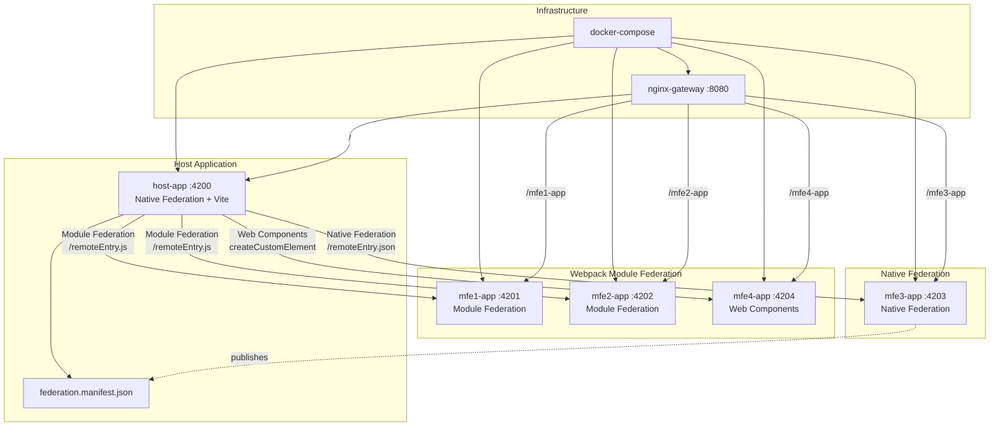

# Angular Microfrontends

Angular microfrontend architecture combining Native Federation and Module Federation.

## Architecture



Summary: A `host-app` loads remote apps (MFE1..MFE4). In production, everything is served through `nginx-gateway` (docker-compose / scripts in `./scripts`). Remotes publish their manifests in `src/assets/federation.manifest*.json`.

## Key Services

- `host-app` — Host (dev port: 4200)
- `mfe1-app` — Remote (4201)
- `mfe2-app` — Remote (4202)
- `mfe3-app` — Remote (4203)
- `mfe4-app` — Remote / Web Component (4204)
- `nginx-gateway` — Proxy (production: port 80)

Logs: `./logs/`

## Quick Start

Development mode (recommended):

```bash
# Start all apps in development mode
./scripts/dev/start.sh

# Stop
./scripts/dev/stop.sh

# Restart
./scripts/dev/restart.sh
```

Production (summarized):

```bash
# Build everything
./scripts/prod/build-all.sh

# (Optional) Build images and deploy
./scripts/prod/deploy.sh

# Or use compose directly
docker-compose up -d --build
```

## Quick Notes

- Ensure ports 4200–4204 are available in dev.
- Federation manifests are in `*/src/assets/federation.manifest*.json`.
- For logs: `tail -f logs/<service>.log` or `docker-compose logs -f`.

## Contributing

1. Create a fork/branch.
2. Add small changes and tests if applicable.
3. Open a PR with description and testing steps.

---

For detailed commands and extended documentation, check the scripts in `./scripts/dev` and `./scripts/prod`.

## License

This project is licensed under the MIT License - see the [LICENSE](LICENSE) file for details.